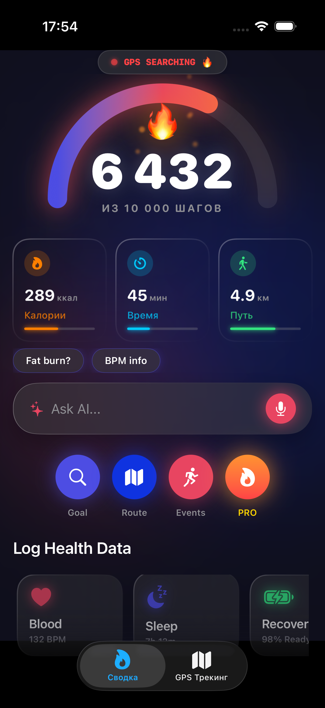
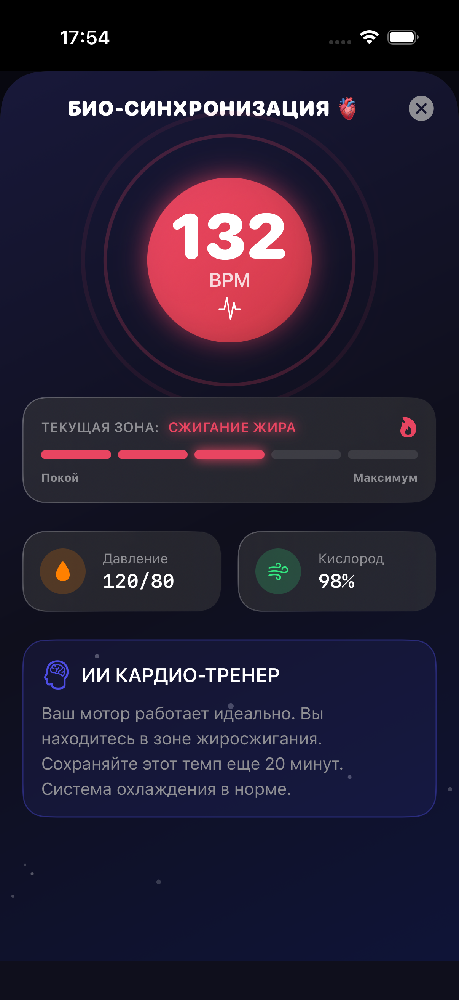
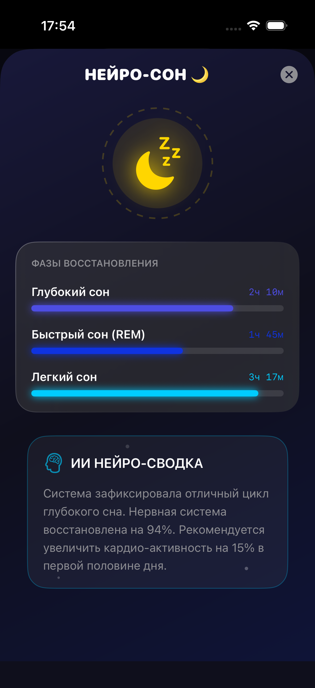
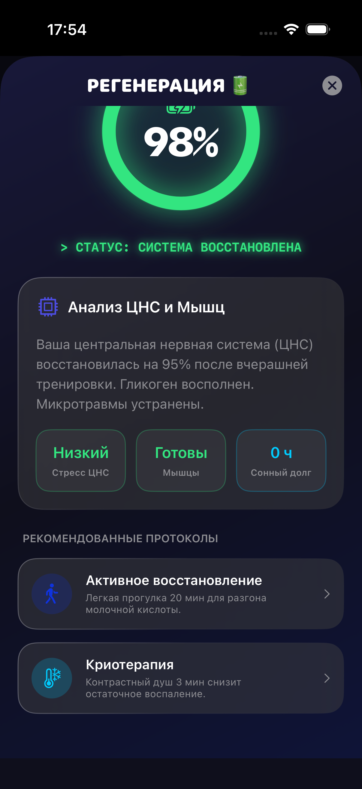
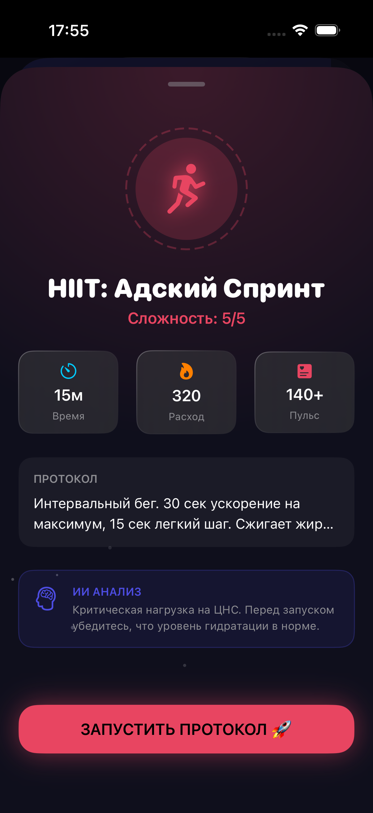
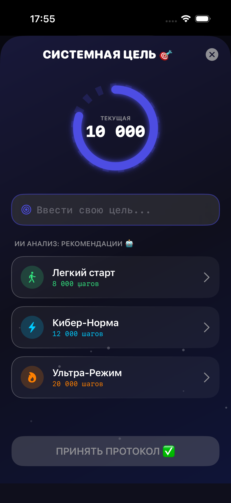
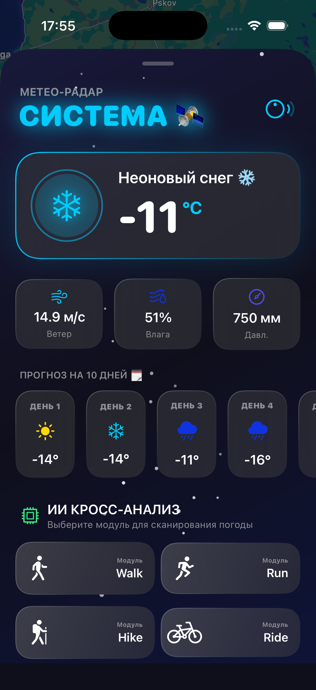
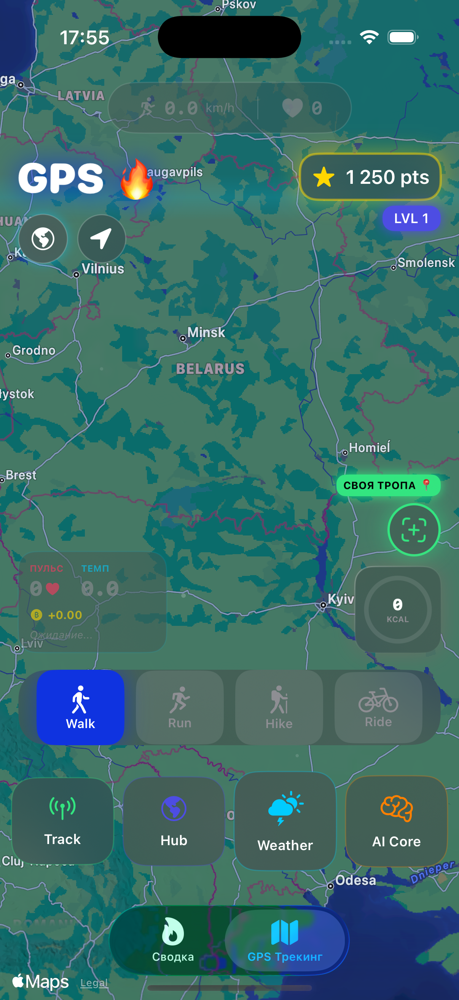
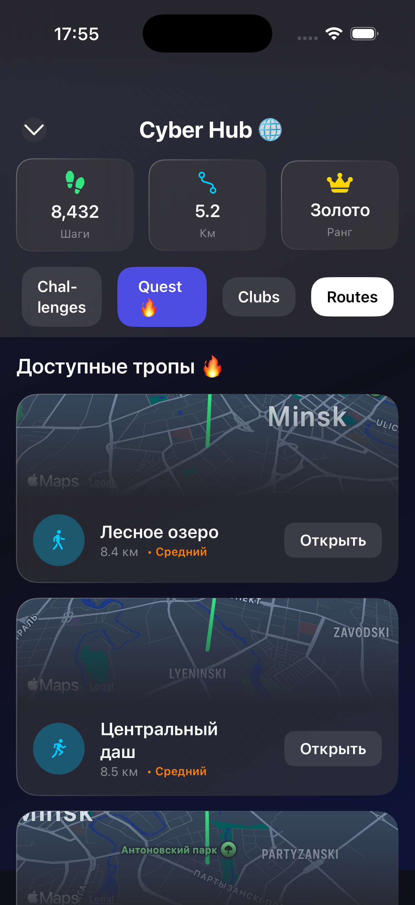

# footstepeR: Cyberpunk Fitness Ecosystem 

**footstepeR** is a state-of-the-art, fully native iOS fitness tracker and pedometer designed with a deep Cyberpunk/Glassmorphism aesthetic. It transcends traditional step-counting by turning your daily activity into an RPG-like experience with neural implants, cyber-clubs, GPS anomalies, and a built-in AI Coach.

> [!]  
> 🚧 **PROJECT IS IN ACTIVE DEVELOPMENT (WORK IN PROGRESS)** 🚧
>
> - This repository currently showcases the **Frontend and UI/UX concept**.
> - The User Interface, complex particle animations, MapKit logic, and navigation are **90% complete**.
> - **AI Integration is pending:** The Neural Coach (Voice & Text chat) is fully designed but operates on mock data. Integration with an external LLM (e.g., OpenAI API) is planned for the next phase.
> - **Backend & Persistence:** Biometrics, club data, and step history are currently generated locally for demonstration purposes. CoreData/SwiftData and remote backend integration are in progress.

---

## 📸 Application Gallery

<table align="center">
  <tr>
    <td align="center"><b>Main Dashboard</b></td>
    <td align="center"><b>Bio-Sync (Heart Rate)</b></td>
    <td align="center"><b>Neuro-Sleep Analysis</b></td>
  </tr>
  <tr>
    <td></td>
    <td></td>
    <td></td>
  </tr>
  <tr>
    <td align="center"><b>CNS Regeneration</b></td>
    <td align="center"><b>Pro Cardio Protocols</b></td>
    <td align="center"><b>AI Goal Architect</b></td>
  </tr>
  <tr>
    <td></td>
    <td></td>
    <td></td>
  </tr>
  <tr>
    <td align="center"><b>Meteo-Radar & Forecast</b></td>
    <td align="center"><b>Live GPS Tracking</b></td>
    <td align="center"><b>Cyber Hub & Routes</b></td>
  </tr>
  <tr>
    <td></td>
    <td></td>
    <td></td>
  </tr>
</table>

---

## 🌟 Core Features

### 🧠 Neural AI Core (WIP)

- **Voice & Text Assistant:** Built-in chat interface for the AI Coach. Utilizes `Speech` and `AVFoundation` to capture and transcribe user voice in real-time. _(Awaiting LLM hookup)_.
- **Cross-Weather Analysis:** The AI scans the "Meteo-Radar" and determines the optimal activity. For instance, it warns against running during "Acid Rain" to prevent virtual joint damage.
- **Biometric Diagnostics:** Dedicated modules for CNS Recovery, Sleep Phases, and Hydration, featuring dynamic AI-generated text summaries of your current physical state.

### 🗺️ Cyberpunk GPS Tracking (MapKit)

- **Interactive Dark Map:** Fully customized Apple Maps integration displaying user location, custom gradient polylines for routes, and neon annotations.
- **Dynamic Events:** While running, the map generates random "Anomalies" (requiring a sudden pace increase to hack for bonus points) or "AI Ghosts" to race against.
- **Smart Routing:** Drop two pins on the map, and `MKDirections` instantly calculates the real-world pedestrian path, distance, and estimated time.

### 🏆 RPG Gamification & Cyber Hub

- **League System:** Global leaderboards ranging from Bronze to Champions tier. Steps are mined into cryptocurrency-like "points" to rank up.
- **Club Wars:** Create or join a Cyber-Club. Set colors, emblems, and challenge rival factions to step-battles.
- **The Black Market:** An in-app economy where users spend earned points on virtual "Implants" (e.g., Titanium Lungs) to boost their step multipliers permanently.

### 🎨 Advanced UI & Glassmorphism

- **Visual Effects:** Replaces standard iOS components with deep Glassmorphism (frosted glass), Mesh Gradients, and custom multi-layered shadows.
- **Particle Systems:** Custom-built `FloatingParticlesView`, Cyber-Snow, and Acid-Rain overlays that react to the current weather and app state.
- **Haptics Engine:** Extensive use of `UIImpactFeedbackGenerator`. Every tap, scan, and milestone achievement provides satisfying, physical tactile feedback.

---

## 🛠 Technical Architecture

This project strictly adheres to modern Apple development paradigms, prioritizing stunning visuals, smooth animations, and reactive code design.

- **UI/UX:** 100% `SwiftUI`. Built with reusable components, custom `ButtonStyle` implementations (for bouncy interactions), and complex `ZStack` geometry.
- **Location Services:** `MapKit` and `CoreLocation` handle real-time user tracking, route rendering (`MKPolyline`), and coordinate-to-path calculations.
- **Voice Recognition:** Pure `Speech` framework paired with `AVAudioEngine` for capturing audio buffers and live speech-to-text translation without blocking the main thread.
- **State Management:** Utilizes `Combine`, `@StateObject`, and `@EnvironmentObject` (`RouteManager`, `LocationManager`) for seamless data flow across the entire app hierarchy.
- **Reactive Simulation:** Uses `Timer.publish` extensively to simulate live heart rate fluctuations, workout progress, and map events smoothly before real HealthKit data is wired up.

---

## 🚀 Installation & Setup

To compile and run this project, you will need **macOS Sonoma** and **Xcode 15.0+** (iOS 17.0+ Simulator or Physical Device required for new MapKit features).

1. **Clone the repository:**
   `git clone https://github.com/YOUR_GITHUB_NAME/footstepeRR.git`

2. **Build and Run:**
   Select a physical iPhone (Highly recommended to test MapKit location tracking, Haptics, and the Microphone) and press `Cmd + R`.
3. **Permissions:**
   Upon first launch, ensure you grant the requested permissions for **Location Services** (for the map) and **Speech Recognition** (for the AI mic button).

---

## 📜 License & Copyright

Copyright (c) 2026 [Boris_Serzhanovich]. All rights reserved.

This project is showcased for **portfolio and demonstration purposes only**. The source code, UI designs, and custom aesthetic models are proprietary. They are not licensed for public, commercial use, redistribution, or modification without explicit written permission from the author.
